数据中心网络DCN-第一章VXLAN（MD版，可直接部署GitHub）

核心知识点梳理：spine-leaf架构（clos）--overlay&underlay--BD--集中式&分布式网关vxlan--EVPN--SDN--业务链--堆叠--mclag---网络出口实现--VPC--虚拟化--云网一体--openstack

一、云网一体化

SDN批量化自动化配置，业务上上线快，敏捷网络

华为SDN=NCE AC ；中兴的SDN-C zenic one

华为的云OS称为：openstack funsion sphere ，类比中兴的tecs open stack，是一个资源池。

二、虚拟化和云计算的关系

虚拟化是云的基础：

- 举例：电脑上安装一个VMvare 这只是虚拟化，一台电脑上通过docker开启几个容器这只是虚拟化，KVM或者Xen都是虚拟化技术（一型虚拟化、二型虚拟化）。

云计算：

- 多个计算机上安装KVM或者Xen，通过控制节点和计算节点协调大量VM；或K8s技术，通过容器化计算实现control-node和worker-node架构统一调度，实现虚拟化无法实现的虚机或容器的调度、迁移技术。

### 云架构分层示意图

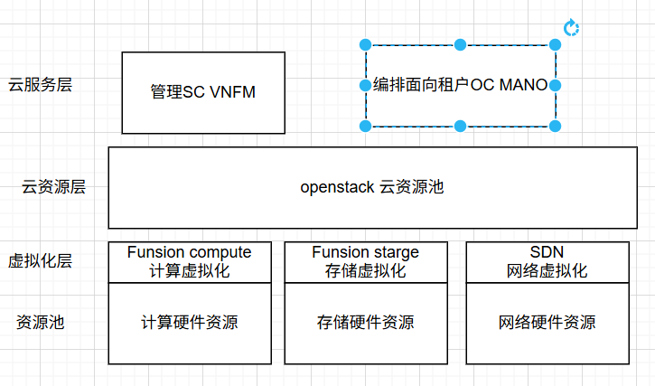

三、spine-leaf架构

说明

POD是数据中心的基本单位，即spine-leaf架构，也叫IP Fabric，不同的POD承担不同的业务：每台leaf都起一个loopback，loopback路由有多下一跳ECMP

spine-leaf架构也叫clos架构、脊-叶架构或“胖树”架构。

### spine-leaf架构示意图

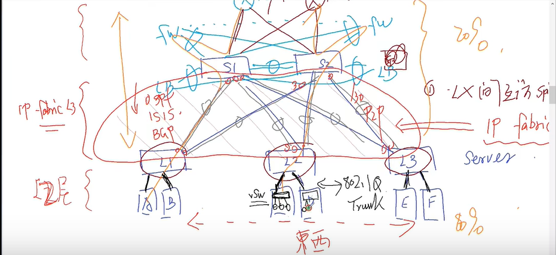

3.1 架构核心细节

- spine-leaf之间的链路都是L3接口，有IP地址。

- leaf角色分类：
        

  - server-leaf：下挂服务器

  - border-leaf：下连PE设备

  - service-leaf：下挂防火墙和LB（VAS）

- spine的作用：转发中间设备，易于扩展。

3.2 与传统LAN三层架构的区别

传统LAN三层架构缺陷：使用2层网络避免环路必须用STP，导致阻塞链路，利用率不高，STP收敛慢于IP。

spine-leaf架构优点：IP网络可无限扩展，易于扩容，spine单点故障不影响整体业务（仅部分业务绕行）。

融合架构：未来部分场景spine也担负border-leaf和service-leaf角色，称为融合架构。

### 融合架构示意图

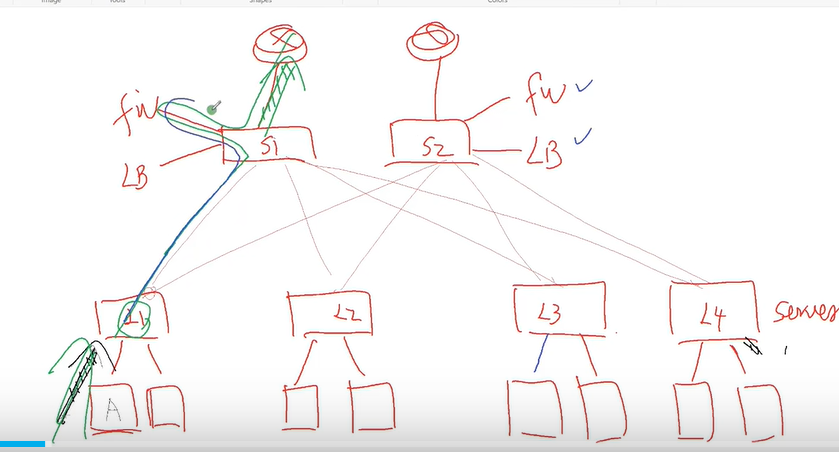

3.3 亚罗局点场景

LB和FW是虚拟形态，部署在计算节点里面，这些VAS业务挂在server-leaf下；DCGW M6000承担独立的boarder-leaf，spine不连网元。

3.4 架构核心问题与解决方案

问题：数据中心中通常东西流量较大；vlanxx的每个成员不会像传统网络那样物理位置固定，可能迁移散落到多个leaf下，spine-leaf的IP网络会隔断vlan，导致跨leaf的vlan成员无法互通。

解决方案：VXLAN协议——把vlan封装到IP层上的隧道技术，属于叠加网络（overlay），在原有underlay网络（spine-leaf架构）上叠加一层新网络，实现leaf下同一vlan的VM跨原3层互通。

### VXLAN叠加网络示意图

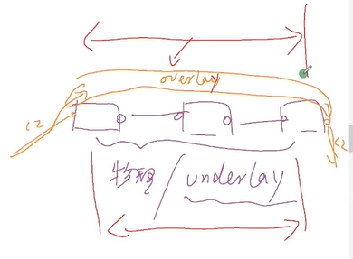

四、VXLAN和BD

4.1 原理

- VXLAN是网络虚拟化的体现，在underlay的IP网络上跑2层数据，实现隧道传输。

- 报文结构：VXLAN头8字节，其中3B的VNI（2的24次方个VNI号码，约1600万），UDP目标端口号4789，源端口随机生成（为了充分利用ECMP路径）。

- 开销说明：原以太网帧封装到VXLAN后会增加50B的开销，IP MTU需从1500提高到1550。

### VXLAN报文开销示意图

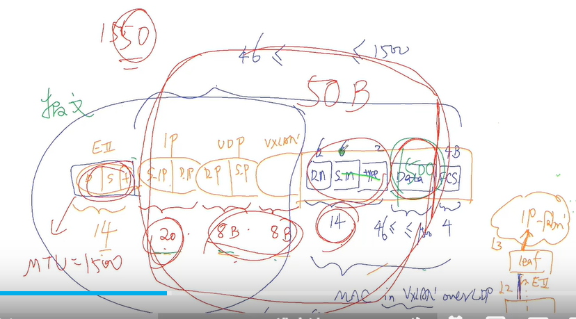

### VXLAN报文格式

VXLAN是MAC in UDP的网络虚拟化技术，其报文封装是在原始以太报文之前添加了一个UDP封装及VXLAN头封装。具体报文格式如下：

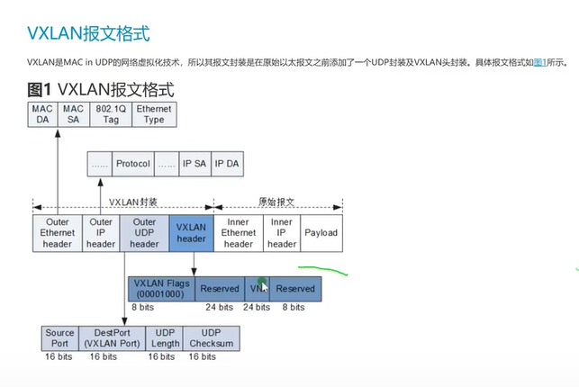

报文结构拆解：

- 外层：IP头、UDP头

- VXLAN头：8 bits VXLAN Flags（固定00001000）、24 bits VNI、24 bits Reserved、8 bits Reserved

- 内层：原始以太网帧（MAC DA、MAC SA、802.1Q Tag、Ethernet Type、Payload）

4.2 跨子网且跨leaf的转发逻辑

- 内层IP：VM的IP

- 内层MAC：VM端口MAC和虚机网关MAC

- 外层IP：leaf1和leaf的loopback地址

- 外层MAC：leaf发送到spine的L3接口MAC，和spine L3接口的MAC

4.3 静态VXLAN配置

### 集中式网关部署方式的VXLAN组网图

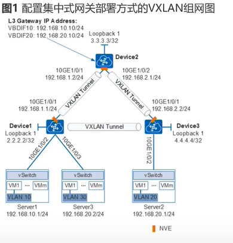

4.4 BD与VLAN、VNI的关联

- BD（Bridge Domain）起衔接作用，将VLAN绑定到VXLAN，BD ID本地有效。

- 中兴设备：通过VPLS，根据dot1q绑定某些VLAN。

- 核心逻辑：一个BD对应一个VNI，但不同VLAN可绑定到一个BD中，实现跨VLAN互通。

- 接口说明：无需创建vlanif，用vbdif接口作为该BD的3层接口，用于跨BD通讯；中兴设备用irbxxx代替vbdif，通过bridge-mapping绑定。

4.5 中兴设备配置示例（VPLS+VXLAN-EVPN）

mpls l2vpn enable

vpls zenic_20000 evpn service-id 67
  rd 1:20000
  bridge-mapping irb210
  description zenic_network:<ZTE_xGWU_153_SX_NET>
  auto-discovery vxlan-evpn
    vni-label 20000
    route-target import 1:20000
    route-target export 1:20000
    rt-2 single-label
  ${{access−pointsmartgroup15.18access−paramsethernet}}$
  $
$

4.6 子接口与Trunk配置说明

子接口是一种特殊Trunk，pvid是“允许列表”（如100、200），理解802.1Q标签后可实现跨VLAN互通。

### 子接口与Trunk配置示意图

4.7 VRF隔离配置

核心需求：spine-leaf的public路由表（全局路由表）只有underlay的路由（spine和leaf的loopback、端口路由），租户的overlay路由需隔离，需单独创建VRF。

ip vrf zenic_218
  ++vpn id 3
  description Gb
  rd 1:6017
  vni-label 6017
  route-target export 1:6017
  route-target import 1:6017
  address-family ipv4
  ${{address−familyipv6}}$
$

4.8 NVE与VTEP的区别

- NVE：设备隧道起点（通用隧道起点）。

- VTEP：特指VXLAN的隧道起点，用全局路由表下的loopback IP作为标识，通常通过OSPF发布给spine（spine属于area 0）。

- 疑问：VTEP地址可以用BGP发布吗？（全局路由表不用OSPF而用BGP是可行的）

### VTEP概念示意图

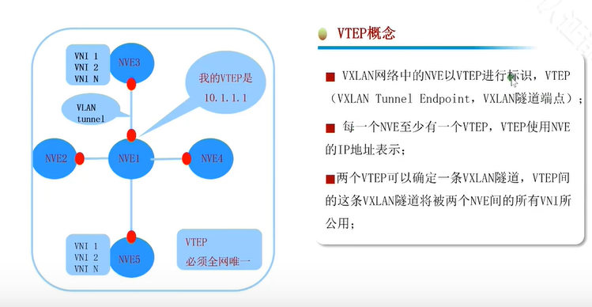

补充说明：两个VTEP可以确定一条VXLAN隧道，该隧道将被两个NVE间的所有VNI共用；VTEP地址必须全网唯一。

4.9 VXLAN UDP源端口随机的原因

为了尽可能随机，路由是基于流的（五元组：源目的IP、源端口、目标端口、协议号），其他属性不可变，唯一可变的是源端口。UDP源端口号根据载荷生成，可实现hash，使underlay层面leaf选路下一跳时更随机，充分利用ECMP路径。

### VXLAN逻辑图

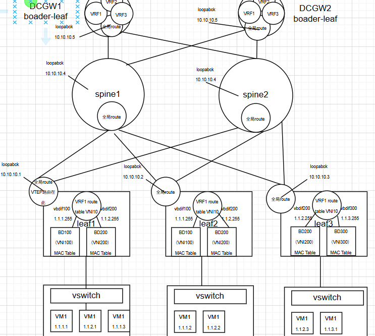

五、亚罗实际物理组网

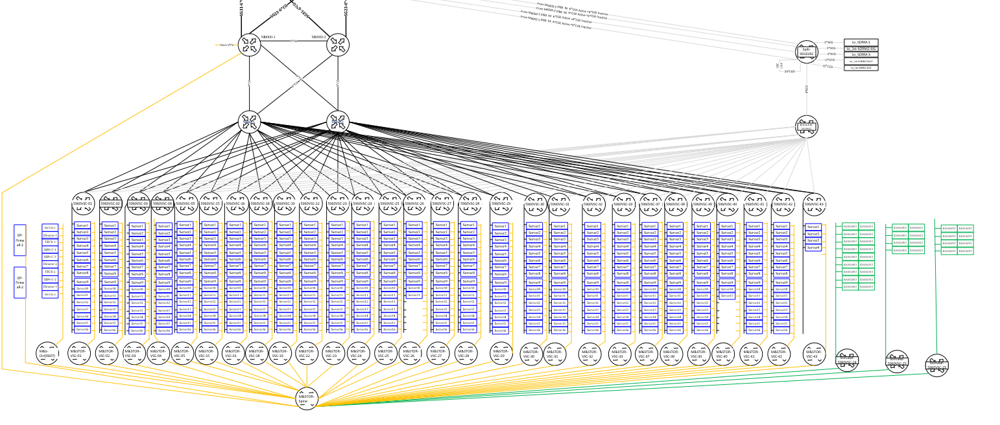

六、VXLAN的BUM帧处理

6.1 BD MAC表示例

MAC address

Port

VNI

aaaaaa

Ac sg10.61(本地下面）

100

bbbbb

Vxlan tunel （远端vtep IP）

100

6.2 设备MAC表查看示例（中兴设备）

YAR-DC2-Service-Leaf-5960VSC-01#show mac vpls instance zenic_20056

MAC            VLAN Outgoing Information Attribute    Age
fa16.3ee7.0f88 0    smartgroup7.17, I:2005 Dynamic      99:12:25:42
fa16.3ebe.491e 0    $vxlan_tunnel8, VNI20056  Dynamic      99:03:32:38
fa16.3eed.f781 0    $vxlan_tunnel9, VNI20056   Dynamic      99:15:07:26
fa16.3e9c.38ae 0    $vxlan_tunnel9, VNI20056   Dynamic      99:15:07:26
fa16.3e79.fa06 0    $vxlan_tunnel9, VNI20056    Dynamic      99:15:07:26
fa16.3eb0.88d9 0    $vxlan_tunnel9, VNI20056   Dynamic      99:15:07:26
fa16.3ead.d236 0    $vxlan_tunnel9, VNI20056    Dynamic      99:15:07:26
fa16.3e7e.2db7 0    $vxlan_tunnel9, VNI20056     Dynamic      99:15:07:26
fa16.3e60.e92a 0    $vxlan_tunnel9, VNI20056     Dynamic      99:15:07:26

6.3 BUM帧转发逻辑

- 单播帧：按MAC表转发。

- BUM帧（MAC表未命中）：按“头端复制”原则转发，本leaf向所有其他leaf各复制一份发送，以“多个单播模拟广播行为”，对设备开销较大。

- 防环机制：水平分割，即从VTEP收到的BUM帧不会再转发给其他VTEP。

### BUM帧头端复制示意图

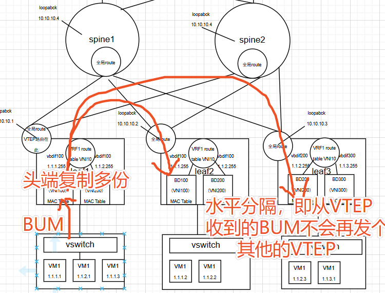

七、VXLAN转发模式（对称 vs 非对称）

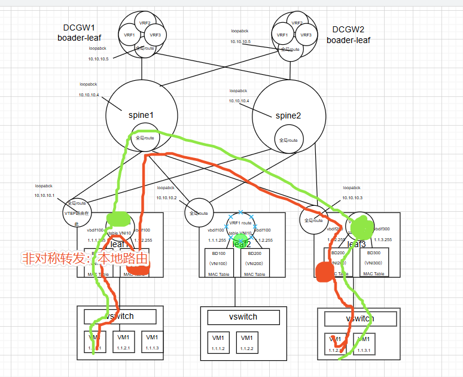

上图红色为非对称式转发，绿色为对称式转发。

7.1 中兴（非对称式转发）

leaf1的网关查VRF 1表后，直接注入到本地对应的VPLS 10 MAC表，封装MAC表10的L2 VNI；回程时，leaf2网关查VRF1路由表，注入本地VPLS 20 MAC表，封装MAC表20的L2 VNI。由于来回VNI不同，称为非对称转发。

7.2 华为（对称式转发）

leaf1的网关查VRF 1表后，对应下一跳是VXLAN隧道，此时封装VRF1表的VNI（即L3 VNI）；到达leaf2后，查leaf2的VRF1表再转发。相当于两次路由，来回封装的都是L3 VNI，VNI相同，称为对称转发。

八、特殊场景问题与解决

问题：如果leaf接的不是服务器而是交换机，由于BPDU报文无法穿越VXLAN隧道，跨leaf的交换机（如sw1和sw2）场景会导致环路。

解决方案：将sw1和sw2上连接leaf的端口的桥ID设置相同，形成m-lag场景。

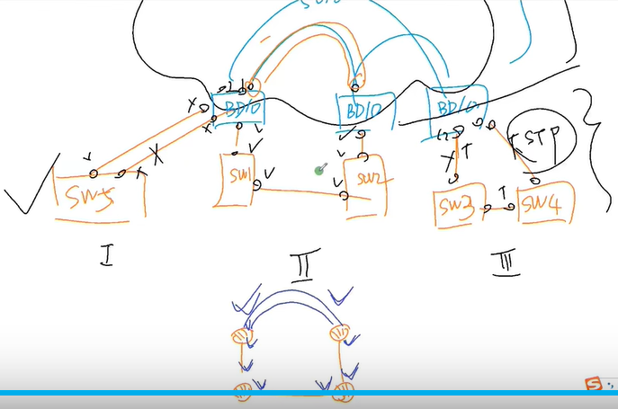

九、集中式网关

集中式网关说明

集中式网关：网关在spine，此时leaf称之为二层vxlan网关，spine为三层vxlan网关。缺点：单点故障，需要双活或四活；对spine的开销非常大，VNI有1600万个，但vbdif接口不能超过4K（产品参数要求）。解决方案：1-4K的vbdif落到spine1-2，4k+1-8K落到spine3-4，一个VRF下的vbdif必须都放到一组spine上，通过这种方式解决开销过大问题；同leaf下的跨网段问题会产生次优路径。

9.1 网关分类

- 二层网关：实现vlan---BD----vxlan绑定关系的设备。

- 三层网关：vbdif（irb）接口的L3接口，不能绑定到public VRF（全局路由表），全局路由表仅用于underlay。

9.2 spine多活实现

spine1和spine2用于指明TEP的loopback地址相同，leaf上的全局路由表可以看到去该loopback地址（如10.10.10.4）的下一跳有2个，分别指向两个接口（如192.168.1.1和192.168.4.1）。

### spine多活示意图

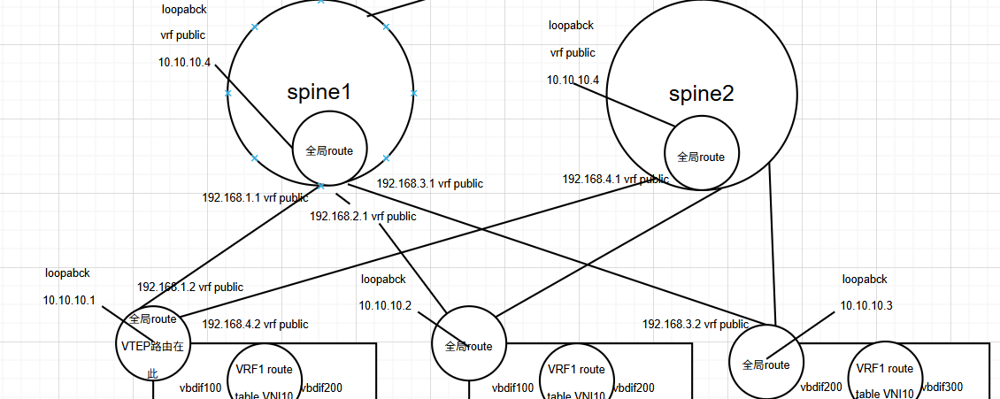

9.3 双活网关常见问题

问题：集中式双活网关（两个spine上配置相同），从网关上ping虚机时回包时断时通。

原因：去程经过spine1查路由，回程经过spine2查路由再转发；若网关没有arp表项同步，回程可能因表项缺失导致首包丢失。

解决方案：spine1和spine2的同VRF的arp表项需要同步。

-------------

